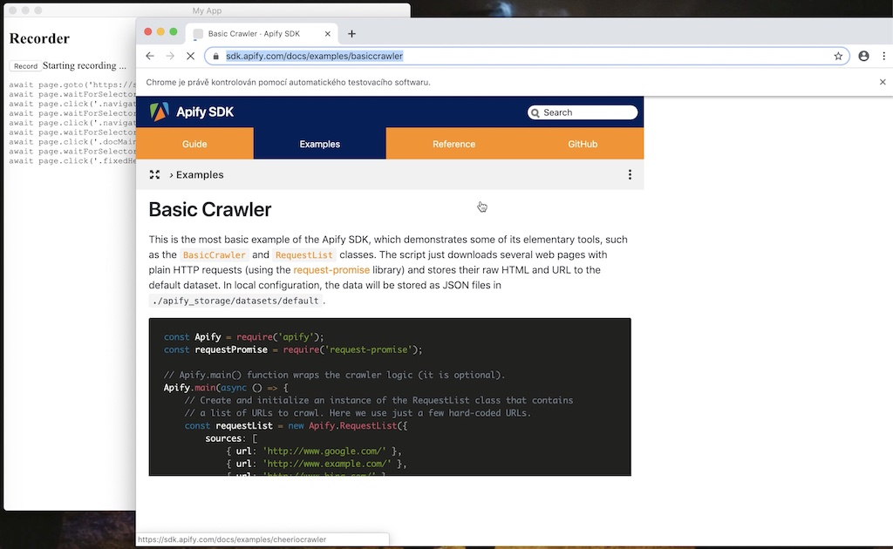

# Puppeteer Recorder POC

Proove of concept of [Puppeteer](https://pptr.dev/) recorder built as [Electron](https://www.electronjs.org/) app.
It allows to record multiple actions such as clicks and replay the recorded flow.

Instalation:

```
npm i
```

To run it call:

```
npm run develop
```

## Demo

<a href="https://github.com/mtrunkat/puppeteer-recorder/blob/master/recorder-demo.mov">Download the video here</a>


